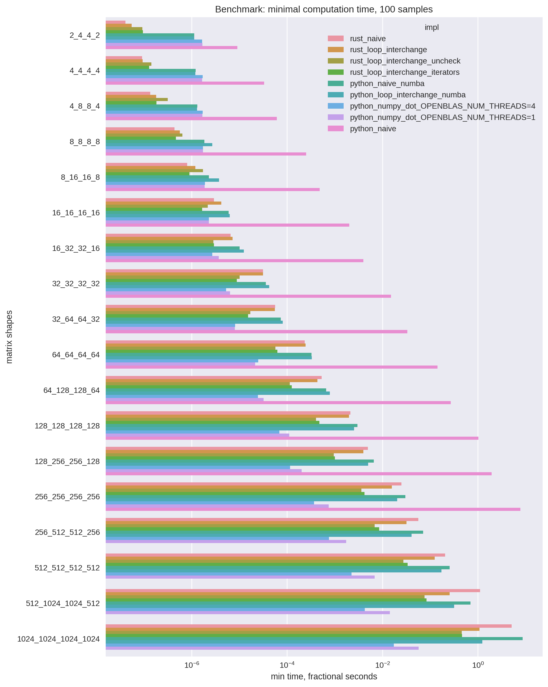

# Matrix-matrix multiplication implementations benchmarking


|              shapes | language   | matmul_impl                      |         min |
|--------------------:|:-----------|:---------------------------------|------------:|
|             2_4_4_2 | rust       | naive                            | 4.1e-08     |
|             2_4_4_2 | rust       | loop_interchange                 | 5.5e-08     |
|             2_4_4_2 | rust       | loop_interchange_iterators       | 9.8e-08     |
|             2_4_4_2 | python     | naive_numba                      | 1.134e-06   |
|             2_4_4_2 | python     | loop_interchange_numba           | 1.138e-06   |
|             2_4_4_2 | python     | numpy_dot_OPENBLAS_NUM_THREADS=4 | 1.648e-06   |
|             2_4_4_2 | python     | numpy_dot_OPENBLAS_NUM_THREADS=1 | 1.681e-06   |
|             2_4_4_2 | python     | naive                            | 9.084e-06   |
|             4_4_4_4 | rust       | naive                            | 9.2e-08     |
|             4_4_4_4 | rust       | loop_interchange                 | 9.4e-08     |
|             4_4_4_4 | rust       | loop_interchange_iterators       | 1.8e-07     |
|             4_4_4_4 | python     | loop_interchange_numba           | 1.196e-06   |
|             4_4_4_4 | python     | naive_numba                      | 1.21e-06    |
|             4_4_4_4 | python     | numpy_dot_OPENBLAS_NUM_THREADS=1 | 1.67e-06    |
|             4_4_4_4 | python     | numpy_dot_OPENBLAS_NUM_THREADS=4 | 1.71e-06    |
|             4_4_4_4 | python     | naive                            | 3.2999e-05  |
|             4_8_8_4 | rust       | naive                            | 1.36e-07    |
|             4_8_8_4 | rust       | loop_interchange                 | 1.81e-07    |
|             4_8_8_4 | rust       | loop_interchange_iterators       | 2.99e-07    |
|             4_8_8_4 | python     | loop_interchange_numba           | 1.3e-06     |
|             4_8_8_4 | python     | naive_numba                      | 1.313e-06   |
|             4_8_8_4 | python     | numpy_dot_OPENBLAS_NUM_THREADS=1 | 1.68e-06    |
|             4_8_8_4 | python     | numpy_dot_OPENBLAS_NUM_THREADS=4 | 1.699e-06   |
|             4_8_8_4 | python     | naive                            | 6.111e-05   |
|             8_8_8_8 | rust       | naive                            | 4.36e-07    |
|             8_8_8_8 | rust       | loop_interchange                 | 5.66e-07    |
|             8_8_8_8 | rust       | loop_interchange_iterators       | 6.24e-07    |
|             8_8_8_8 | python     | numpy_dot_OPENBLAS_NUM_THREADS=1 | 1.731e-06   |
|             8_8_8_8 | python     | numpy_dot_OPENBLAS_NUM_THREADS=4 | 1.738e-06   |
|             8_8_8_8 | python     | naive_numba                      | 1.851e-06   |
|             8_8_8_8 | python     | loop_interchange_numba           | 2.717e-06   |
|             8_8_8_8 | python     | naive                            | 0.000251612 |
|           8_16_16_8 | rust       | naive                            | 8.04e-07    |
|           8_16_16_8 | rust       | loop_interchange_iterators       | 8.85e-07    |
|           8_16_16_8 | rust       | loop_interchange                 | 1.202e-06   |
|           8_16_16_8 | python     | numpy_dot_OPENBLAS_NUM_THREADS=1 | 1.868e-06   |
|           8_16_16_8 | python     | numpy_dot_OPENBLAS_NUM_THREADS=4 | 1.891e-06   |
|           8_16_16_8 | python     | naive_numba                      | 2.315e-06   |
|           8_16_16_8 | python     | loop_interchange_numba           | 3.733e-06   |
|           8_16_16_8 | python     | naive                            | 0.000484225 |
|         16_16_16_16 | rust       | loop_interchange_iterators       | 1.6e-06     |
|         16_16_16_16 | python     | numpy_dot_OPENBLAS_NUM_THREADS=1 | 2.289e-06   |
|         16_16_16_16 | python     | numpy_dot_OPENBLAS_NUM_THREADS=4 | 2.311e-06   |
|         16_16_16_16 | rust       | naive                            | 2.954e-06   |
|         16_16_16_16 | rust       | loop_interchange                 | 4.16e-06    |
|         16_16_16_16 | python     | naive_numba                      | 5.955e-06   |
|         16_16_16_16 | python     | loop_interchange_numba           | 6.311e-06   |
|         16_16_16_16 | python     | naive                            | 0.00202464  |
|         16_32_32_16 | python     | numpy_dot_OPENBLAS_NUM_THREADS=4 | 2.724e-06   |
|         16_32_32_16 | rust       | loop_interchange_iterators       | 3.574e-06   |
|         16_32_32_16 | python     | numpy_dot_OPENBLAS_NUM_THREADS=1 | 3.694e-06   |
|         16_32_32_16 | rust       | naive                            | 6.585e-06   |
|         16_32_32_16 | rust       | loop_interchange                 | 7.253e-06   |
|         16_32_32_16 | python     | naive_numba                      | 1.0084e-05  |
|         16_32_32_16 | python     | loop_interchange_numba           | 1.2496e-05  |
|         16_32_32_16 | python     | naive                            | 0.00397362  |
|         32_32_32_32 | python     | numpy_dot_OPENBLAS_NUM_THREADS=4 | 5.268e-06   |
|         32_32_32_32 | python     | numpy_dot_OPENBLAS_NUM_THREADS=1 | 6.39e-06    |
|         32_32_32_32 | rust       | loop_interchange_iterators       | 7.915e-06   |
|         32_32_32_32 | rust       | loop_interchange                 | 3.1189e-05  |
|         32_32_32_32 | rust       | naive                            | 3.1453e-05  |
|         32_32_32_32 | python     | naive_numba                      | 3.6077e-05  |
|         32_32_32_32 | python     | loop_interchange_numba           | 4.2312e-05  |
|         32_32_32_32 | python     | naive                            | 0.0151586   |
|         32_64_64_32 | python     | numpy_dot_OPENBLAS_NUM_THREADS=1 | 7.993e-06   |
|         32_64_64_32 | python     | numpy_dot_OPENBLAS_NUM_THREADS=4 | 8.106e-06   |
|         32_64_64_32 | rust       | loop_interchange_iterators       | 1.8138e-05  |
|         32_64_64_32 | rust       | loop_interchange                 | 5.527e-05   |
|         32_64_64_32 | rust       | naive                            | 5.6308e-05  |
|         32_64_64_32 | python     | naive_numba                      | 7.433e-05   |
|         32_64_64_32 | python     | loop_interchange_numba           | 8.1226e-05  |
|         32_64_64_32 | python     | naive                            | 0.0332958   |
|         64_64_64_64 | python     | numpy_dot_OPENBLAS_NUM_THREADS=1 | 2.1443e-05  |
|         64_64_64_64 | python     | numpy_dot_OPENBLAS_NUM_THREADS=4 | 2.4962e-05  |
|         64_64_64_64 | rust       | loop_interchange_iterators       | 5.1974e-05  |
|         64_64_64_64 | rust       | naive                            | 0.000233358 |
|         64_64_64_64 | rust       | loop_interchange                 | 0.000243321 |
|         64_64_64_64 | python     | naive_numba                      | 0.000325634 |
|         64_64_64_64 | python     | loop_interchange_numba           | 0.000330492 |
|         64_64_64_64 | python     | naive                            | 0.142963    |
|       64_128_128_64 | python     | numpy_dot_OPENBLAS_NUM_THREADS=4 | 2.4557e-05  |
|       64_128_128_64 | python     | numpy_dot_OPENBLAS_NUM_THREADS=1 | 3.2402e-05  |
|       64_128_128_64 | rust       | loop_interchange_iterators       | 0.000117157 |
|       64_128_128_64 | rust       | loop_interchange                 | 0.000433922 |
|       64_128_128_64 | rust       | naive                            | 0.000527876 |
|       64_128_128_64 | python     | naive_numba                      | 0.000656887 |
|       64_128_128_64 | python     | loop_interchange_numba           | 0.000789128 |
|       64_128_128_64 | python     | naive                            | 0.269775    |
|     128_128_128_128 | python     | numpy_dot_OPENBLAS_NUM_THREADS=4 | 6.9473e-05  |
|     128_128_128_128 | python     | numpy_dot_OPENBLAS_NUM_THREADS=1 | 0.00011069  |
|     128_128_128_128 | rust       | loop_interchange_iterators       | 0.000355878 |
|     128_128_128_128 | rust       | loop_interchange                 | 0.00198741  |
|     128_128_128_128 | rust       | naive                            | 0.00211838  |
|     128_128_128_128 | python     | loop_interchange_numba           | 0.00253365  |
|     128_128_128_128 | python     | naive_numba                      | 0.00298101  |
|     128_128_128_128 | python     | naive                            | 1.02076     |
|     128_256_256_128 | python     | numpy_dot_OPENBLAS_NUM_THREADS=4 | 0.000115107 |
|     128_256_256_128 | python     | numpy_dot_OPENBLAS_NUM_THREADS=1 | 0.000200865 |
|     128_256_256_128 | rust       | loop_interchange_iterators       | 0.000911426 |
|     128_256_256_128 | rust       | loop_interchange                 | 0.00397211  |
|     128_256_256_128 | rust       | naive                            | 0.0049346   |
|     128_256_256_128 | python     | loop_interchange_numba           | 0.00500387  |
|     128_256_256_128 | python     | naive_numba                      | 0.00654814  |
|     128_256_256_128 | python     | naive                            | 1.93112     |
|     256_256_256_256 | python     | numpy_dot_OPENBLAS_NUM_THREADS=4 | 0.000370298 |
|     256_256_256_256 | python     | numpy_dot_OPENBLAS_NUM_THREADS=1 | 0.00074354  |
|     256_256_256_256 | rust       | loop_interchange_iterators       | 0.00359232  |
|     256_256_256_256 | rust       | loop_interchange                 | 0.0156426   |
|     256_256_256_256 | python     | loop_interchange_numba           | 0.0203815   |
|     256_256_256_256 | rust       | naive                            | 0.0249146   |
|     256_256_256_256 | python     | naive_numba                      | 0.0300829   |
|     256_256_256_256 | python     | naive                            | 7.73768     |
|     256_512_512_256 | python     | numpy_dot_OPENBLAS_NUM_THREADS=4 | 0.000755285 |
|     256_512_512_256 | python     | numpy_dot_OPENBLAS_NUM_THREADS=1 | 0.00172441  |
|     256_512_512_256 | rust       | loop_interchange_iterators       | 0.00734839  |
|     256_512_512_256 | rust       | loop_interchange                 | 0.0316979   |
|     256_512_512_256 | python     | loop_interchange_numba           | 0.0406425   |
|     256_512_512_256 | rust       | naive                            | 0.0565698   |
|     256_512_512_256 | python     | naive_numba                      | 0.0706965   |
|     512_512_512_512 | python     | numpy_dot_OPENBLAS_NUM_THREADS=4 | 0.00223443  |
|     512_512_512_512 | python     | numpy_dot_OPENBLAS_NUM_THREADS=1 | 0.00688939  |
|     512_512_512_512 | rust       | loop_interchange_iterators       | 0.0292794   |
|     512_512_512_512 | rust       | loop_interchange                 | 0.124312    |
|     512_512_512_512 | python     | loop_interchange_numba           | 0.172666    |
|     512_512_512_512 | rust       | naive                            | 0.205607    |
|     512_512_512_512 | python     | naive_numba                      | 0.257431    |
|   512_1024_1024_512 | python     | numpy_dot_OPENBLAS_NUM_THREADS=4 | 0.00423702  |
|   512_1024_1024_512 | python     | numpy_dot_OPENBLAS_NUM_THREADS=1 | 0.0142917   |
|   512_1024_1024_512 | rust       | loop_interchange_iterators       | 0.0596537   |
|   512_1024_1024_512 | rust       | loop_interchange                 | 0.256322    |
|   512_1024_1024_512 | python     | loop_interchange_numba           | 0.318879    |
|   512_1024_1024_512 | python     | naive_numba                      | 0.700258    |
|   512_1024_1024_512 | rust       | naive                            | 1.11825     |
| 1024_1024_1024_1024 | python     | numpy_dot_OPENBLAS_NUM_THREADS=4 | 0.0173084   |
| 1024_1024_1024_1024 | python     | numpy_dot_OPENBLAS_NUM_THREADS=1 | 0.057143    |
| 1024_1024_1024_1024 | rust       | loop_interchange_iterators       | 0.436467    |
| 1024_1024_1024_1024 | rust       | loop_interchange                 | 1.08788     |
| 1024_1024_1024_1024 | python     | loop_interchange_numba           | 1.2439      |
| 1024_1024_1024_1024 | rust       | naive                            | 5.13137     |
| 1024_1024_1024_1024 | python     | naive_numba                      | 8.68298     |


## Machine info

>lscpu
```
Architecture:        x86_64
CPU op-mode(s):      32-bit, 64-bit
Byte Order:          Little Endian
CPU(s):              8
On-line CPU(s) list: 0-7
Thread(s) per core:  2
Core(s) per socket:  4
Socket(s):           1
NUMA node(s):        1
Vendor ID:           GenuineIntel
CPU family:          6
Model:               142
Model name:          Intel(R) Core(TM) i5-8265U CPU @ 1.60GHz
Stepping:            12
CPU MHz:             1900.034
CPU max MHz:         3900.0000
CPU min MHz:         400.0000
BogoMIPS:            3600.00
Virtualization:      VT-x
L1d cache:           32K
L1i cache:           32K
L2 cache:            256K
L3 cache:            6144K
NUMA node0 CPU(s):   0-7
Flags:               fpu vme de pse tsc msr pae mce cx8 apic sep mtrr pge mca cmov pat pse36 clflush dts acpi mmx fxsr sse sse2 ss ht tm pbe syscall nx pdpe1gb rdtscp lm constant_tsc art arch_perfmon pebs bts rep_good nopl xtopology nonstop_tsc cpuid aperfmperf pni pclmulqdq dtes64 monitor ds_cpl vmx est tm2 ssse3 sdbg fma cx16 xtpr pdcm pcid sse4_1 sse4_2 x2apic movbe popcnt tsc_deadline_timer aes xsave avx f16c rdrand lahf_lm abm 3dnowprefetch cpuid_fault epb invpcid_single ssbd ibrs ibpb stibp ibrs_enhanced tpr_shadow vnmi flexpriority ept vpid fsgsbase tsc_adjust bmi1 avx2 smep bmi2 erms invpcid mpx rdseed adx smap clflushopt intel_pt xsaveopt xsavec xgetbv1 xsaves dtherm ida arat pln pts hwp hwp_notify hwp_act_window hwp_epp md_clear flush_l1d arch_capabilities
```

>poetry run python -c "import numpy; numpy.show_config()"
```
blas_mkl_info:
  NOT AVAILABLE
blis_info:
  NOT AVAILABLE
openblas_info:
    libraries = ['openblas', 'openblas']
    library_dirs = ['/usr/local/lib']
    language = c
    define_macros = [('HAVE_CBLAS', None)]
blas_opt_info:
    libraries = ['openblas', 'openblas']
    library_dirs = ['/usr/local/lib']
    language = c
    define_macros = [('HAVE_CBLAS', None)]
lapack_mkl_info:
  NOT AVAILABLE
openblas_lapack_info:
    libraries = ['openblas', 'openblas']
    library_dirs = ['/usr/local/lib']
    language = c
    define_macros = [('HAVE_CBLAS', None)]
lapack_opt_info:
    libraries = ['openblas', 'openblas']
    library_dirs = ['/usr/local/lib']
    language = c
    define_macros = [('HAVE_CBLAS', None)]
```

>rustc --version --verbose
```
rustc 1.54.0 (a178d0322 2021-07-26)
binary: rustc
commit-hash: a178d0322ce20e33eac124758e837cbd80a6f633
commit-date: 2021-07-26
host: x86_64-unknown-linux-gnu
release: 1.54.0
LLVM version: 12.0.1
```

>poetry run python -m numba -s
```
System info:
--------------------------------------------------------------------------------
__Time Stamp__
Report started (local time)                   : 2021-10-03 15:33:47.723610
UTC start time                                : 2021-10-03 12:33:47.723617
Running time (s)                              : 1.628139

__Hardware Information__
Machine                                       : x86_64
CPU Name                                      : skylake
CPU Count                                     : 8
Number of accessible CPUs                     : 8
List of accessible CPUs cores                 : 0-7
CFS Restrictions (CPUs worth of runtime)      : None

CPU Features                                  : 64bit adx aes avx avx2 bmi bmi2
                                                clflushopt cmov cx16 cx8 f16c fma
                                                fsgsbase fxsr invpcid lzcnt mmx
                                                movbe pclmul popcnt prfchw rdrnd
                                                rdseed sahf sgx sse sse2 sse3
                                                sse4.1 sse4.2 ssse3 xsave xsavec
                                                xsaveopt xsaves

Memory Total (MB)                             : 23804
Memory Available (MB)                         : 8832

__OS Information__
Platform Name                                 : Linux-4.15.0-153-generic-x86_64-with-glibc2.27
Platform Release                              : 4.15.0-153-generic
OS Name                                       : Linux
OS Version                                    : #160-Ubuntu SMP Thu Jul 29 06:54:29 UTC 2021
OS Specific Version                           : ?
Libc Version                                  : glibc 2.27

__Python Information__
Python Compiler                               : GCC 7.5.0
Python Implementation                         : CPython
Python Version                                : 3.8.6
Python Locale                                 : en_GB.UTF-8

__Numba Toolchain Versions__
Numba Version                                 : 0.54.0
llvmlite Version                              : 0.37.0

__LLVM Information__
LLVM Version                                  : 11.1.0

__CUDA Information__
CUDA Device Initialized                       : False
CUDA Driver Version                           : ?
CUDA Runtime Version                          : ?
CUDA Detect Output:
None
CUDA Libraries Test Output:
None

__SVML Information__
SVML State, config.USING_SVML                 : False
SVML Library Loaded                           : False
llvmlite Using SVML Patched LLVM              : True
SVML Operational                              : False

__Threading Layer Information__
TBB Threading Layer Available                 : False
+--> Disabled due to Unknown import problem.
OpenMP Threading Layer Available              : True
+-->Vendor: GNU
Workqueue Threading Layer Available           : True
+-->Workqueue imported successfully.

__Numba Environment Variable Information__
None found.
```